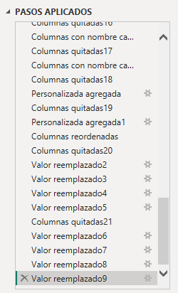
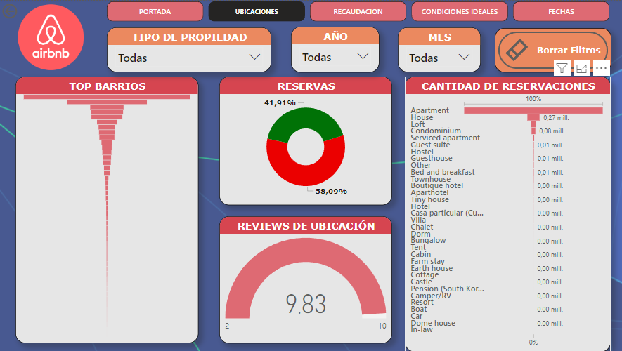
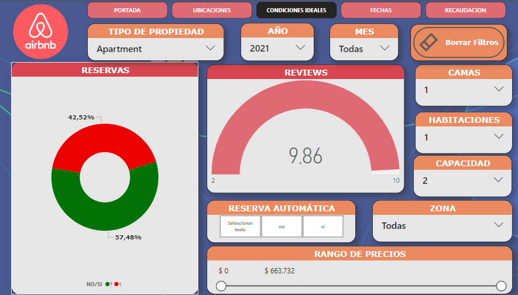
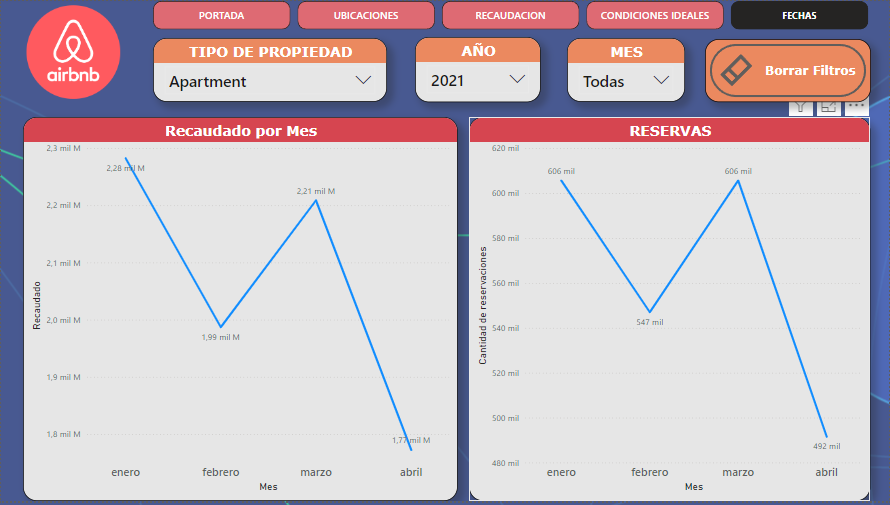
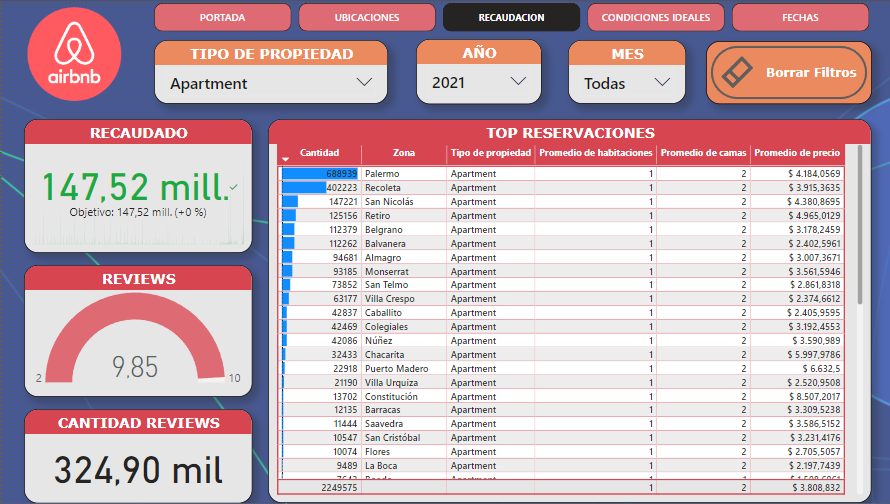
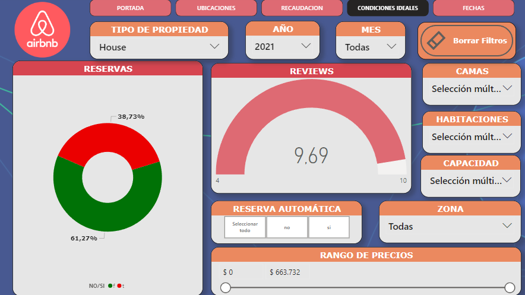
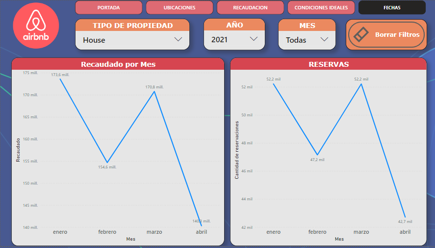
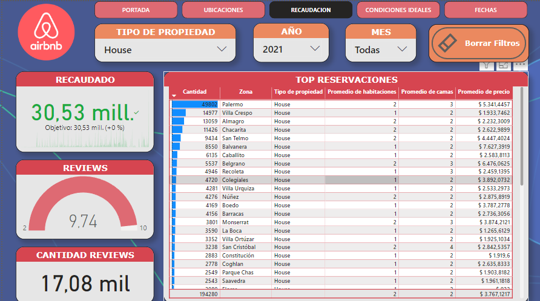

# PROYECTO INTEGRADOR AIRBNB

___

A continuación detallaré mi proyecto individual del módulo 5, de la carrera Data Science de Soy Henry. El objetivo de este trabajo práctico es aplicar los conceptos y técnicas aprendidos en el módulo para realizar un análisis exploratorio y descriptivo de un conjunto de datos reales. Personalmente he elegido Airbnb por el interés por el tipo de contenido que este involucra.

___

### Descripción del trabajo realizado:

Iré mostrando el Power Bi creado para analizar los datasets:

___

### Datasets otorgados:
Se han trabajado los csv únicamente desde PowerBi, reorganizando nombres de columnas para su fácil entendimiento, promediando valores atípicos, quitando columnas con la totalidad de valores nulos, y dándole importancia a aquellos datos en buen estado.
A continuación se muestran imágenes de algunos de los pasos aplicados:

___

### Dashboard: (diesño)
Una vez procesados los datos, he trabajado en la estructura del dashboard, colocando una imagen de fondo que contraste con el color principal de la paleta de colores (rojo) La idea es decorar sin quitar atención de la información importante.
___

### Dashboard: (portada)
En la portada, he realizado un menú muy sencillo, que no detenga la atención del receptor en este punto, pero que le brinde las herramientas necesarias para comenzar a mirar el análisis. 
Cuenta con botones para redirigir al usuario a la respectiva página.

___

### Dashboard: (ubicaciones)
Demuestra los ingresos y reservaciones en las distintas  zonas/barrios, 

___

### Dashboard: (condiciones ideales)
Aquí podemos interactuar con distintos filtros para encontrar qué combinación de características del alojamiento sube la tasa de reservaciones y/o reviews.

___

### Dashboard: (fechas)
En esta página, podremos identificar en qué momento del año tenemos más reservaciones, y en qué momentos hay mayor gasto en alojamientos.

___

### Dashboard: (recaudación)
Aquí podremos visualizar el resultado del análisis, figuraba en una tabla el tipo de alquiler más reservado, dependiendo de los criterios anteriormente definidos. Además que tendremos un contador de lo recaudado en esa categoría.

___

### Preguntas de la consigna:

* ¿Qué podemos describir con los datasets acerca del negocio de airbnb?
* ¿Cuál es la mejor forma de invertir en AirBnb?
* ¿Cómo se compara con otras alternativas de inversión?
* Si presentamos nuestras conclusiones a un grupo inversor: ¿Qué propuestas le haríamos?
* ¿En donde sugerimos invertir?
* ¿En qué tipo de propiedad?

En este informe se abordarán todas las preguntas planteadas de manera integrada y detallada. Esta metodología permite ofrecer un análisis exhaustivo y coherente, facilitando una comprensión profunda del negocio de Airbnb y sus oportunidades de inversión. Al responder a las preguntas de manera conjunta, podemos generar respuestas de alta calidad que abarquen un amplio espectro de información, asegurando que todas las posibles dudas sean despejadas y proporcionando una visión integral que es esencial para tomar decisiones informadas.

___

# Análisis:

En el análisis realizado, podemos describir que el negocio de airbnb en Buenos Aires tiene un gran volumen de ofertas de alojamientos, y reservaciones concretadas. Generando un gran flujo de dinero entre huéspedes y anfitriones. Este análisis puede llamar a posibles inversores que quieran cubrir la demanda existente de este negocio para su beneficio económico propio.

Para encontrar la mejor inversión tenemos muchos parámetros para analizar, Si nos enfocamos podemos identificar rápidamente que toda la base de datos corresponde a Buenos Aires, Argentina.
Partiendo de esto, podemos analizar en un principio el tipo de alojamiento, y encontraremos que el ranking de ofertas son:
1) Departamento
2) Casa

___

A continuación analizaremos este ranking que definiremos los más solicitados, y encontraremos las condiciones ideales para que nuestra propiedad se alquile rápidamente. (se dará más importancia a los resultados del 2021, ya que el 2020 es un año atípico) 

___

### Departamento:
Los barrios con más departamentos en alquiler son: Palermo y Recoleta.
Con las condiciones de mayores reservas estas son las características:
* Camas: 1 a 3
* Habitaciones: 0 y 1
* Huéspedes: 1 a 3

Con respecto a fechas, vemos que el mes más solicitado fué Enero, seguido por Marzo:

En la página de recaudación, vemos la gran liquidez que genera este tipo de propiedad:

___

### Casas:
Los barrios con más casas en alquiler son: Palermo, Balvanera, San Tempo. de igual modo los siguientes en el top, no reflejan gran diferencia de lo recaudado con su siguiente.
Las mejores características son:
* Camas: 2 o 3
* Habitaciones: 1 o 2
* Huéspedes: 2 a 4

Con respecto a fechas, vemos que el mes más solicitado fué Enero, seguido por Marzo al igual que los departamentos:

Recaudación:

___

# RESUMEN

Con toda la información analizada, podemos concluir que, podemos concluir y por lo tanto recomendar la siguiente inversión ideal. Se considera ideal debido a su cantidad de reservaciones y la recaudación que esta genera:

* Opción 1: Departamento de 1 habitación con 1 cama para dos personas, en zona de Palermo, para alquilar con un promedio de $4184 el Día

* Opción 2: Casa de 2 habitaciones, con 3 camas para 2 a 4 personas, en zona de Palermo, para alquilar con un promedio de $5341 el Día
